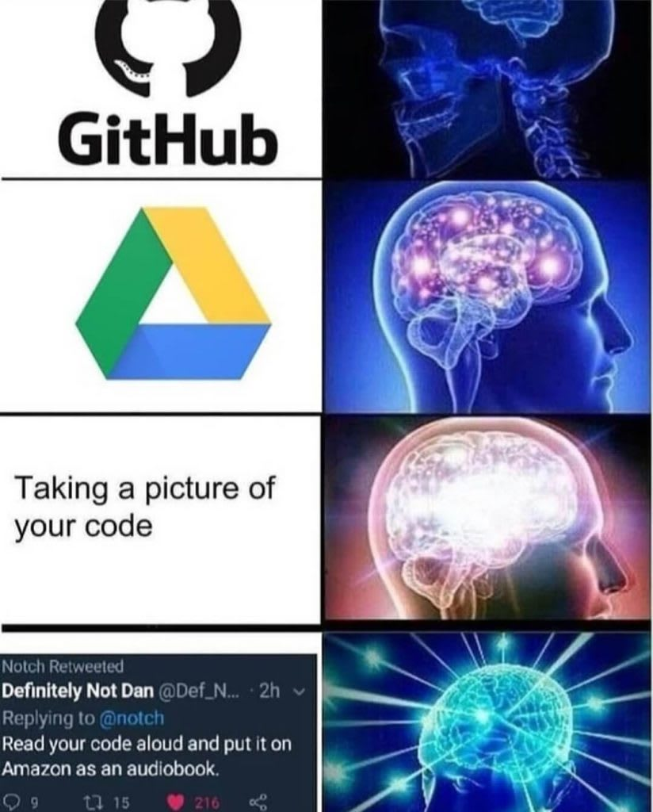

## 1. Version Control: Cool, but why?




**Git** is a tool that tracks changes to your code over time — like a timeline or save history for your project.

**GitHub** is a website that hosts Git repositories online so you can share your code and collaborate with others.

Why use them?

- Track changes as you work.
- Revert mistakes easily.
- Work with others without overwriting each other’s code.
- Keep your local and online versions in sync.

During this workshop, your projects will live in **GitHub repos** -- shared (or private) folders where all your code, changes, and history are stored.

### Consistent Project Structure  
Once you’re using GitHub, having a consistent project layout makes it easier to:
- Understand others' code quickly.
- Reuse, extend, or debug projects.
- Move projects between local machines and cloud environments (like CyVerse).
- Avoid confusion and missing dependencies.

In short: **Git** keeps your changes safe. **GitHub** makes collaboration possible. **Structure** keeps everything tidy.

---

## 2. What’s Inside a Typical GitHub Repo?

Here’s what you’ll usually see in a GitHub repo (and why it helps):

- `README.md` — What your project does, how to run it, any important notes.
- `environment.yml` or `requirements.txt` — Lists the Python packages needed to run your code.
- `notebooks/` — Jupyter notebooks for exploration, training, or demos.
- `src/` or `project_name/` — Your actual Python code, scripts, modules.
- `data/` — (If included) Sample or small data files. Bigger data = handled outside GitHub.
- `tests/` — Optional, but great for checking if your code still works after changes.
- `.gitignore` — Tells Git what *not* to track (e.g. `.ipynb_checkpoints`, `env/`, `.DS_Store`).
- `LICENSE` — Choose one if your code is open-source. MIT is a safe default.
- `.github/` — Optional automation/configs for GitHub (like workflows or templates).

No need to use all of these -- start simple, but know what’s out there. Clean repos are easier to use, share, and scale. A sample (but not so simple) repo structure is here: 


## 3. GitHub: Just Tell Me What I Need to Know

You’ll hear a lot of terms like "clone", "commit", "pull request", "fork", etc. Here's what they mean — and why we use them.

### Repository (aka "Repo")
A project folder tracked by Git, hosted on GitHub. This is where all your code and history lives.

### Clone
You **copy a repo from GitHub to your local machine**, so you can work on it.  
_Why?_ You can’t edit a GitHub repo directly from your laptop — you need a local copy.

### Commit
You **save a snapshot of your changes** with a short message.  
_Why?_ Commits let you track what changed, when, and why — and you can always roll back if needed.

### Push
You **upload your local commits to GitHub**.  
_Why?_ This keeps your online repo up to date — and shareable with others.

### Pull
You **bring down new changes from GitHub to your machine**.  
_Why?_ If someone else made updates, you need to sync up before continuing.

### Branch
You **create a separate line of work** without affecting the main code.  
_Why?_ It’s safer to experiment or add features in a branch before merging.

### Pull Request (PR)
You **ask to merge your branch into the main project** — and others can review it first.  
_Why?_ PRs keep the main code clean and stable. They also make collaboration easier.

### Fork
You **make your own copy of someone else’s repo** (on GitHub, not your machine).  
_Why?_ You can propose changes to someone else’s project, even without direct access.

---

You don’t need to memorize all this now -- we’ll walk through each step live. But it helps to know *why* we do these things before we do them.

## Feeling Ready?

So now that you kinda know what Git and GitHub are... Let’s actually use them.

---

🛠️ **This is the hands-on part. Please follow along if you can.**

We’re going to:

- Set up your tools (Git, GitHub, VS Code)
- Create your first GitHub repository
- Clone it to your machine
- Make a change and push it back
- Learn how to use branches and pull requests
- Try contributing to someone else’s repo using forks
- (Bonus!) Simulate and fix a merge conflict

This sounds like a lot -- but we’ll walk through it step by step, and you’ll be surprised how smooth it is once you get going.

Let’s start by getting your machine ready.

## 4. Getting Ready

Before we start working with Git and GitHub, you need a few things set up on your machine.

---

### Install Git

Check if Git is already installed:

```bash
git --version
```

If you see a version number, you're good.

If not:

- **Windows**: Install [Git for Windows](https://git-scm.com/download/win) — it includes Git Bash.
- **Mac**: Run `git` in Terminal; it may prompt you to install Xcode tools.
- **Linux**: Use your package manager:

  ```bash
  sudo apt install git
  ```

Once installed, configure Git with your name and email:

```bash 
git config --global user.name "Your Name"  
git config --global user.email "you@example.com"
```

---

### Create a GitHub Account

If you don’t have one, go to [github.com](https://github.com/) and sign up.  
Pick a username, verify your email, and you’re in.

---

### Set Up VS Code

Download and install [Visual Studio Code](https://code.visualstudio.com/). It’s lightweight, powerful, and works great with Git and Python.

Then:

1. Open VS Code.
2. Go to the Extensions tab (left sidebar).
3. Install:
   - **Python** (by Microsoft)
   - **GitHub Pull Requests and Issues** (optional)
   - **GitLens** (optional, for better Git history views)

Make sure Git works inside VS Code:

- Open the terminal inside VS Code.
- Run `git --version`.

If you see a version number, you're good to go.

---


## 5. Create and Clone a Repo

### Create a New Repository on GitHub

1. Go to [github.com](https://github.com).
2. Click the **+** in the top right → **New repository**.
3. Give it a name (e.g., `my-first-repo`).
4. Check **"Add a README file"**.
5. Click **Create repository**.

Now you have a repo! Let’s bring it to your machine.

---

### Clone the Repo Locally

```bash
git clone https://github.com/your-username/my-first-repo.git  
cd my-first-repo
```

This creates a folder on your machine with all the files from the GitHub repo. You're ready to start working!

---

## 6. Make, Commit, and Push a Change

### Edit a File

Open the `README.md` file in VS Code. Change or add a line — anything simple.

---

### Stage and Commit

Check what changed:

```bash
git status
```

Stage the file:

```bash
git add README.md
```

Commit it with a message:

```bash
git commit -m "Update README"
```

---

### Push to GitHub

```bash
git push
```

Go to your repo on GitHub -- you’ll see your change there.

---

## 7. Branching and Pull Requests

### Create a Branch

```bash
git checkout -b my-feature
```

This creates a new branch and switches to it.

---

### Make Changes and Push

Edit a file again, then:

```bash
git add README.md  
git commit -m "Edit on my-feature branch"  
git push -u origin my-feature
```

---

### Open and Merge a Pull Request

1. Go to your repo on GitHub.
2. You’ll see a **"Compare & pull request"** button. Click it.
3. Add a short description and click **"Create pull request"**.
4. Click **"Merge pull request"**, then **"Confirm"**.

Done! Your change is now in `main`.

---

## 8. Forking and Upstream PRs

### Fork a Repo on GitHub

Go to a repo you want to contribute to and click **Fork** (top right).  
This creates a copy under your account.

---

### Clone Your Fork

```bash
git clone https://github.com/your-username/demo-repo.git  
cd demo-repo
```

---

### Push Changes and Submit a PR to the Original Repo

1. Make your change.
2. Then:

```bash
git checkout -b fix-readme  
git add README.md  
git commit -m "Fix typo in README"  
git push -u origin fix-readme
```

3. Go to GitHub and open a pull request — from your fork to the original repo.

That’s how you contribute to someone else’s project.

## 10. Merge Conflicts (Bonus)

Sometimes two people edit the same part of a file. Git doesn’t know which version to keep -- that’s a conflict. Here’s how to simulate and fix one.

---

### Simulate a Conflict

1. Make sure your repo is up to date:

```bash
git checkout main  
git pull
```

2. Create a new branch and edit the README:

```bash
git checkout -b branch-one
```

Edit a line in `README.md`, save it, then:

```bash
git add README.md  
git commit -m "Edit from branch-one"  
git push -u origin branch-one
```

3. Switch back to `main` and create another branch:

```bash
git checkout main  
git checkout -b branch-two
```
Edit the **same line** in `README.md`, save, then:

```bash
git add README.md  
git commit -m "Edit from branch-two"
```

Now try to merge `branch-one` into `branch-two`:

```bash
git merge branch-one
```

You’ll see a **conflict warning**.

---

### Resolve the Conflict Locally

Open the file — Git will show conflict markers like this:

```text
<<<<<<< HEAD
Edit from branch-two
=======
Edit from branch-one
>>>>>>> branch-one
```
Edit the file to keep what you want, remove the markers, then:

```bash
git add README.md
git commit -m "Resolve conflict"
```

Done. The conflict is fixed, and the merge is complete. Merge conflicts are normal -- don’t panic. Just read the file, choose what to keep, and commit.

## 11. Best Practices

### ✅ Keep Commits Small and Clear
Make one or few logical change(s) per commit (e.g., "add new function" or "fix typo"). Avoid dumping unrelated edits into a single commit.

### ✅ Write Meaningful Commit Messages
Use short but clear messages like:
- `fix image path bug`
- `loss function refactor for multiclass`
- `update README with bibtex`

Better to avoid generic ones like `update` or `stuff`.

### ❌ Don't Upload (Bulky) Data or Secrets
Large datasets, credentials, API keys, `.env` files -- don’t add them to GitHub.
You can use shared drives or cloud buckets instead.

### ✅ Use `.gitignore`
Avoid committing unnecessary or generated files:
- Add `.ipynb_checkpoints/`, `__pycache__/`, `*.csv`, `*.h5`, etc.
- Keep repos clean and fast to clone.

### ✅ Push Often
Push your changes regularly -- don’t sit on lots of uncommitted work.

### ✅ Stay Organized
Group related files into folders (`notebooks/`, `src/`, etc.), and name things clearly. Others (and especially  _future you_) will thank you.

---
## 🎉 That’s It — You Did It!

If you’ve followed along this far -or even if you just scrolled your way here- **congrats**! You’ve just walked through the core of how version control things are done in the real world. Please keep using these tools during the workshop -- and beyond. You have got this \o/